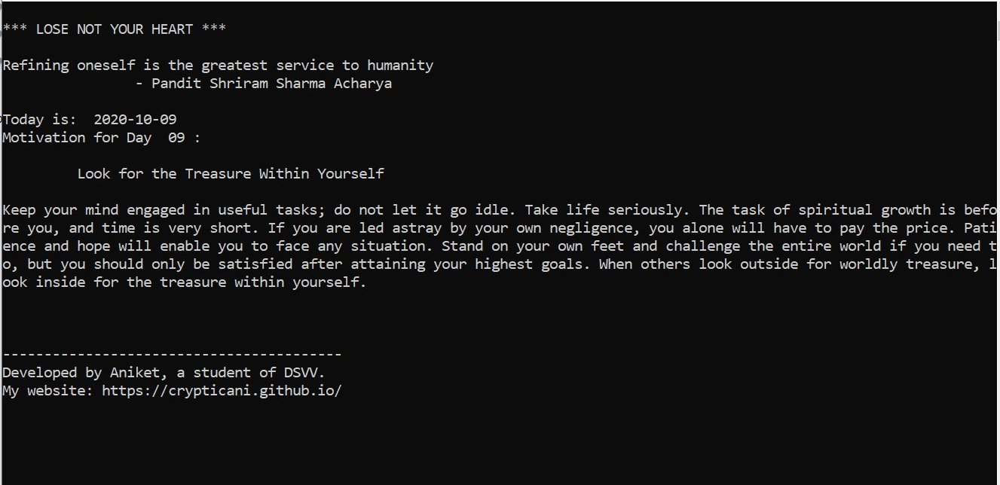

<aside>
 <font color="blue"> <a href="https://github.com/crypticani/himmat/raw/master/himmat.deb" class="button"><small>Download</small> .deb file <small>    for Linux</small></a>   
  </font>
 </aside>
  


## Platforms supported
Linux and Windows

## How to use it on Windows
- Download the **zip** file for Windows
- Extract the zip file using winrar or 7zip
- Click on **himmat.exe**


## Installing instruction for Linux
### For debian based distros
#### Via terminal:
```
$ wget https://github.com/crypticani/himmat/raw/master/himmat.deb
$ sudo gdebi himmat.deb
```
#### Via GUI:
- Download .deb package
- Double click on the downloaded file
- Click on install

### How to use it
1. Open the terminal
2. Enter the command:
```
$ himmat
```

### For other distros like fedora(via terminal)
- Download tar.gz file
- Extract the archive
- run using ```$ ./himmat ```


    
### How to uninstall from debian based distros
1. Open the terminal
2. Enter the following command:
```
  $ sudo apt remove himmat
```  

.

#### Copyright 2020 Aniket Kumar

   Licensed under the Apache License, Version 2.0 (the "License");
   you may not use this file except in compliance with the License.
   You may obtain a copy of the License at

       http://www.apache.org/licenses/LICENSE-2.0

   Unless required by applicable law or agreed to in writing, software
   distributed under the License is distributed on an "AS IS" BASIS,
   WITHOUT WARRANTIES OR CONDITIONS OF ANY KIND, either express or implied.
   See the License for the specific language governing permissions and
   limitations under the License.
   
