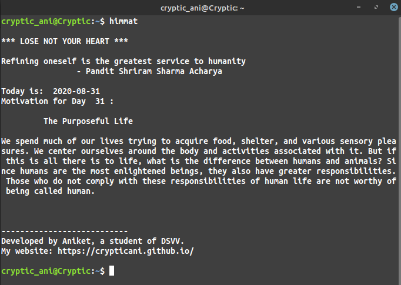
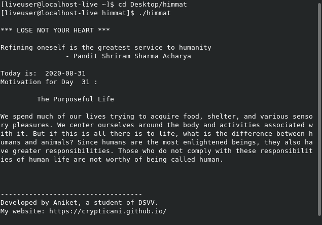

<div>
 <font color="blue"> <a href="https://crypticani.github.io/files/himmat.deb" class="button">Download <small>    .deb for linux</small></a>     <a href="https://github.com/crypticani/himmat/releases/download/v0.2/himmat.tar.gz" class="button">Download <small>    tar.gz for linux</small></a></font>
  </div>
  



## Platforms supported
Currently, only Debian based Linux distros like Ubuntu, Linux Mint, Parrot, Kali Linux, etc. are supported.
Alternatively, you can also download the tar.gz file, if you want to run it on other Linux distros like fedora, Arch, OpenSUSE, etc.

## How to download
### To download .deb package, <a href="crypticani.github.io/files/himmat.deb"><b>click here</b></a>.

### To download it via terminal, type:
```
$ wget crypticani.github.io/files/himmat.deb
```

## How to install
To install the deb file, you can either use GUI or terminal. For tar.gz, just extract the archive and run using ```$ ./himmat ```



#### Method 1: GUI
1. Move to the folder where deb file is located
2. Double click on _himmat.deb_
3. Click on install.

#### Method 2: via terminal
1. Open terminal
2. Move to the folder containing deb file
3. Enter following command:
```
  $ sudo gdebi himmat.deb
  ```
4. Enter *y*

## How to use it
1. Open the terminal
2. Enter the command:
```
    $ himmat
  ```
    
## How to uninstall
1. Open the terminal
2. Enter the following command:
```
  $ sudo apt remove himmat
```  

.

#### Copyright 2020 Aniket Kumar

   Licensed under the Apache License, Version 2.0 (the "License");
   you may not use this file except in compliance with the License.
   You may obtain a copy of the License at

       http://www.apache.org/licenses/LICENSE-2.0

   Unless required by applicable law or agreed to in writing, software
   distributed under the License is distributed on an "AS IS" BASIS,
   WITHOUT WARRANTIES OR CONDITIONS OF ANY KIND, either express or implied.
   See the License for the specific language governing permissions and
   limitations under the License.
   
